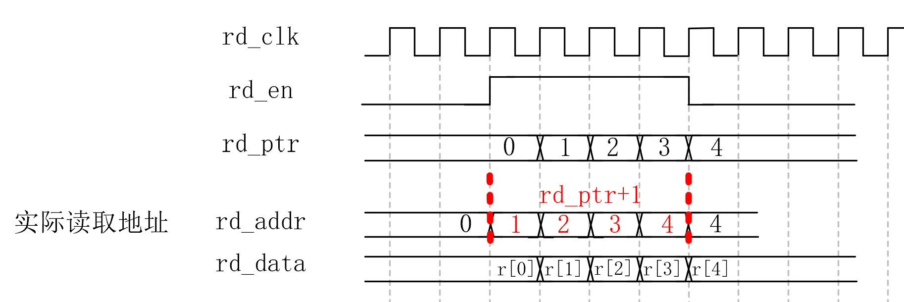

#### 总述

本设计是一个支持非对称读写操作的，带有读写数量计数器的异步FIFO。其主要特性有:

- [x] 支持相同或不同的读写时钟(异步FIFO)
- [x] 支持相同或不同的读写位宽
- [x] 支持读写数据个数统计
- [x] 可映射到FPGA的BRAM硬件资源
- [x] 支持"First Word Fall Through"FIFO读操作或标准FIFO读操作
- [x] 空满标志

总的来说，可用本设计替代常用的FPGA上FIFO IP核，以实现对FIFO的灵活配置

设计整体框图如图1。


<center>图1. 异步FIFO框图</center>

目前仿真未发现问题，将本设计部署到[FPGA_DDR3_Ctrl](https://github.com/lauchinyuan/FPGA_DDR3_Ctrl)工程上，亦可在FPGA上正常工作。但也不排除后期出现问题的可能，若您发现存有任何Bug, 还请联系我，以求改进。

[rtl代码](./rtl)含有相对详细的注释，同时本设计所有子模块都有独立的[testbench](./testbench)文件进行简单的功能仿真，[doc](./doc)文件夹下包含了本设计的模块框图和简单设计说明，若您有任何问题，欢迎通过lauchinyuan@yeah.net联系我。

#### 如何使用

##### 基本参数配置

顶层模块为[async_fifo](./rtl/async_fifo.v)，通过例化模块，更改模块的参数，即可实现对FIFO的灵活配置, 参数说明如下:

```verilog
parameter   RAM_DEPTH        //内部RAM存储器深度
			RAM_ADDR_WIDTH   //内部RAM读写地址宽度, 值为log2(RAM_DEPTH)
            WR_WIDTH         //写数据位宽
            RD_WIDTH         //读数据位宽
            WR_IND           //单次写操作访问的ram单元个数
            RD_IND           //单次读操作访问的ram单元个数         
            RAM_WIDTH        //RAM存储单元位宽
            WR_L2            //log2(WR_IND)
            RD_L2            //log2(RD_IND)
            WR_CNT_WIDTH     //FIFO写端口计数器的位宽
            RD_CNT_WIDTH     //FIFO读端口计数器的位宽  
            RAM_RD2WR        //读数据位宽和写数据位宽的比, 即一次读取的RAM单元深度,当读位宽小于等于写位宽时,值为1
```

参数间符合以下关系:

```verilog
// 参数依赖关系:
// 注意: 读写位宽之比必须是2的幂，WR_IND、RD_IND也必须是2的幂
parameter RAM_ADDR_WIDTH = log2(RAM_DEPTH)；	
parameter WR_IND = WR_WIDTH/RAM_WIDTH；
parameter RD_IND = RD_WIDTH/RAM_WIDTH；
parameter WR_CNT_WIDTH = RAM_ADDR_WIDTH + 1 - log2(WR_IND)；
parameter RD_CNT_WIDTH = RAM_ADDR_WIDTH + 1 - log2(RD_IND)；
parameter WR_L2  = log2(WR_IND)；
parameter RD_L2  = log2(RD_IND)；
parameter RAM_RD2WR = RAM_RD_WIDTH/RAM_DATA_WIDTH；
```

参数配置的一个例子如下:

```verilog
  parameter RAM_DEPTH       = 'd1024                        , //内部RAM存储器深度
			RAM_ADDR_WIDTH  = 'd10                          , //内部RAM读写地址宽度, 值为log2(RAM_DEPTH)
            RAM_DEPTH       = 'd64                          , //写数据位宽
            RD_WIDTH        = 'd32                          , //读数据位宽
            WR_IND          = 'd2                           , //单次写操作访问的ram单元个数
            RD_IND          = 'd1                           , //单次读操作访问的ram单元个数         
            RAM_WIDTH       = RD_WIDTH                      , //写端口数据位宽更小,使用写数据位宽作为RAM存储器的位宽
            WR_L2           = 'd1                           , //log2(WR_IND), 决定写地址有效数据位个数及RAM位宽
            RD_L2           = 'd0                           , //log2(RD_IND), 决定读地址有效低位
            WR_CNT_WIDTH    = RAM_ADDR_WIDTH + 'd1 - WR_L2  , //FIFO写端口计数器的位宽
            RD_CNT_WIDTH    = RAM_ADDR_WIDTH + 'd1 - RD_L2  , //FIFO读端口计数器的位宽  
            RAM_RD2WR       = 'd1                           ； //读数据位宽和写数据位宽的比, 即一次读取的RAM单元深度, RAM_RD2WR = RD_WIDTH/WR_WIDTH, 当读位宽小于等于写位宽时, 值为1
```

##### First Word Fall Through模式开关

本设计可选择是否支持“First Word Fall Through”读取模式，在该模式下，FIFO读使能信号`rd_en`有效时，输出数据就已经是有效数据，而在"标准FIFO“模式下，在读使能信号`rd_en`有效的下一个读时钟周期下的输出数据才认为是有效数据。

通过[async_fifo](./rtl/async_fifo.v)文件内的宏定义`FWFT_ON`决定是否支持“First Word Fall Through”模式。定义该宏，则FIFO为“First Word Fall Through”读取模式, 注释掉该宏定义, 即是"标准FIFO"。

##### FPGA RAM硬件类型选择

本设计可以在FPGA上指定综合后映射的RAM硬件类型(block RAM或者distributed RAM)，在[dual_port_ram](./rtl/dual_port_ram.v)文件内存储空间reg定义时，加上(\*ram_style="block"\*)语句，即可引导Vivado将该存储器综合为BRAM，否则Vivado将大概率使用LUT来生成存储器。

#### 实现细节说明

##### 如何进行数据个数计数？

将读写指针位宽比RAM地址位宽多设置1bit即可实现辅助计数。 若读写指针最高位相同，则写指针减去读指针即为数据个数，在FIFO逻辑中，总是先写后读，若出现”读指针大于写指针“的情况，必定是写指针已经计数完一个循环回到了低位，因此将最高位进行调整之后再相减。

例如对于一个RAM深度为4的情况，RAM地址线宽度为 $log_2(8)=2$, 则设置读写指针位宽为3，则数据个数计数的两种情况说明如图2、图3所示。


<center>图2. 数据个数计数例子1</center>


<center>图3. 数据个数计数例子2</center>

##### 读写指针跨时钟域与格雷码

同步FIFO下，通过读写指针之间的差值，即可方便得到FIFO内存储单元的数据个数。 而在异步FIFO中，由于读写时钟不同，读写指针不在一个时钟域，因此读写指针相减或者比较时，需要进行跨时钟域处理。本设计使用格雷码对读写指针进行编码，由于格雷码相邻编码之间只有1bit数据发生变化，通过同步处理后，可以极大概率降低读写指针跨时钟域数据出错的概率。

由于读写位宽可变，读写指针每次自增的值也不再固定为1，假设RAM数据位宽`RAM_WIDTH`为8bit， 而写数据位宽`WR_WIDTH`为32bit，则写指针`wr_ptr`每完成一次写操作，自增4， 例如写指针从2’b0000变化到2‘b0100, 在这个过程中，格雷码从2’b0000变化到2‘b0110，变化了2bit， **失去了格雷码相邻编码只变化1bit的特性**。

在上面的例子中，写指针的高位从2’b00变化到2‘01，对应的格雷码仍是相邻编码变化1bit, 故在进行跨时钟域处理时，**舍去低位，只对高位指针进行格雷码转换**，并进行跨时钟域处理，跨时钟域处理过程如图4所示。

本设计中需要用到读写个数计数器，故在写端口需要读时钟域同步过来的读指针`rd_ptr_sync`， 读端口同样需要写时钟域同步过来的写指针`rd_ptr_sync`。


<center>图4. 跨时钟域传输示意图</center>

##### 空满标志的判断

- 写满信号

  在写时钟域下，若写指针`wr_ptr`和同步读指针`rd_ptr_sync`的最高位不同，而其它位都相同时，便表示FIFO写满。

- 读空信号

  在读时钟域下，若读指针`rd_ptr`和同步写指针`wr_ptr_sync`相同时，表示FIFO读空。

##### First Word Fall Through模式的实现

FPGA的BRAM资源的读取，规定是要与读时钟`rd_clk`同步的，即输出数据并不与读地址对齐，而是比读地址慢一拍，为了实现FWFT读取，让读地址在读FIFO使能信号`rd_en`有效时，让输入的读指针提前自增，这样从外部看来，读数据和对应的读地址是对齐的。波形示意图如图5。



<center>图5. First Word Fall Through实现示意图</center>